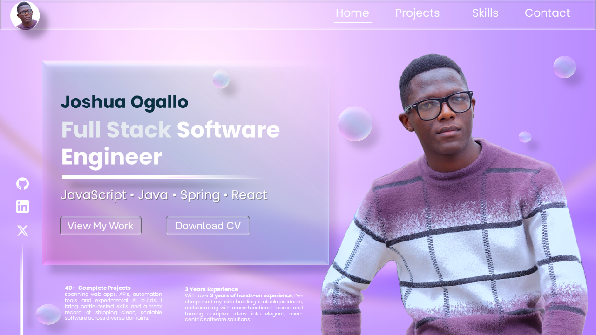

<h1 align="center">🚀 Joshua Ogallo — Portfolio</h1>
<p align="center"><em>A futuristic hackathon-ready personal portfolio crafted with precision, motion and flair.</em></p>

<br/>

<div align="center">
  
</div>

<br/>

<p align="center">
  A slick, animated showcase built using <strong>HTML5</strong>, <strong>Tailwind CSS</strong> and <strong>JavaScript</strong> to highlight my skills, projects and creative build ethos — geared towards both hackathon judges and real-world clients.
</p>

---

## ⚡ Features

- ⚙️ Clean, expressive & futuristic design
- 📱 Fully responsive (mobile-first)
- ✨ Glitch/neon-style hover animations
- 🛠️ Sections → Hero, About, Skills, Projects, Contact
- 🌍 Live demo hosted on Netlify

---

## 💻 Tech Stack

| Markup  | Styling        | Script        |
|--------|----------------|---------------|
| HTML5  | Tailwind CSS   | JavaScript ES6|

---

## 🔽 Local Setup

```bash
git clone https://github.com/YOUR-USERNAME/YOUR-REPO-NAME.git
cd YOUR-REPO-NAME
# open index.html in your browser
