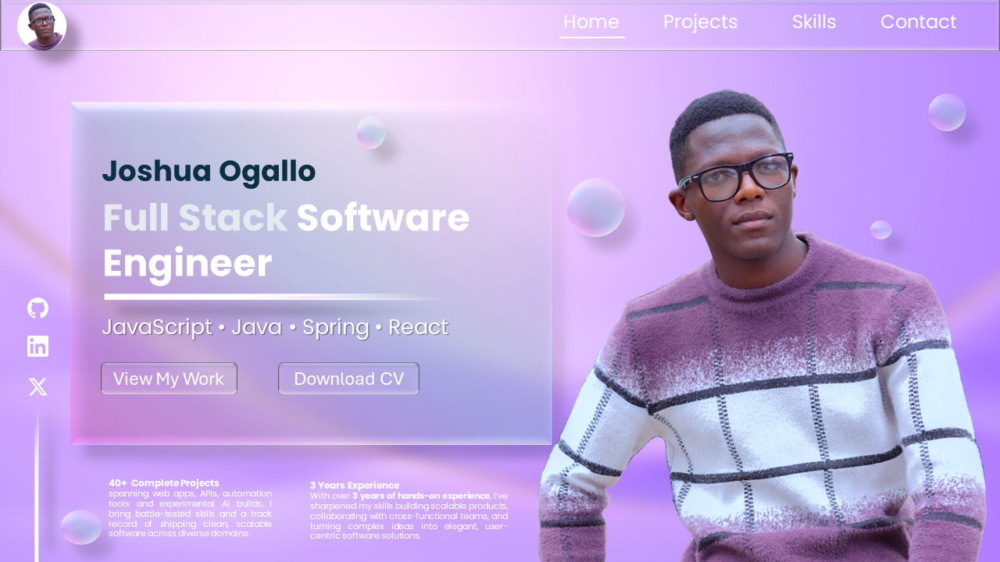

<h1 align="center">✨ Joshua Ogallo ✨</h1>
<h3 align="center">🚀 Futuristic Developer Portfolio | Hackathon Ready</h3>

<p align="center">
  <a href="https://ogallo.netlify.app/"><strong>🌐 Live Demo</strong></a> •
  <a href="#features"><strong>✨ Features</strong></a> •
  <a href="#tech-stack"><strong>🛠️ Tech Stack</strong></a> •
  <a href="#contact"><strong>📬 Contact</strong></a>
</p>

<div align="center">
  
</div>

<br/>

<p align="center">
  <em>A cutting-edge portfolio blending cyberpunk aesthetics with modern web development. Built for hackathon excellence and client impact.</em>
</p>

---

## 🌟 Features <a name="features"></a>

<div align="center">
  
| Category       | Highlights                                                                 |
|----------------|---------------------------------------------------------------------------|
| **Design**     | Futuristic UI • Glitch effects • Smooth animations • Dark/neon theme      |
| **Function**   | Fully responsive • Optimized performance • Accessible components          |
| **Content**    | Project showcases • Skill matrix • Contact form • Interactive elements    |

</div>

---

## 🛠️ Tech Stack <a name="tech-stack"></a>

<div align="center">

### Core Technologies


### Deployment


</div>

---

## 🏗️ Project Structure

```bash
.
├── index.html          # Main entry point
├── src/
│   ├── css/            # Custom styles
│   ├── js/             # Interactive components
│   └── assets/         # Icons & additional resources
├── img/                # All visual assets
│   └── readmehero.png  # Preview image
└── ...
